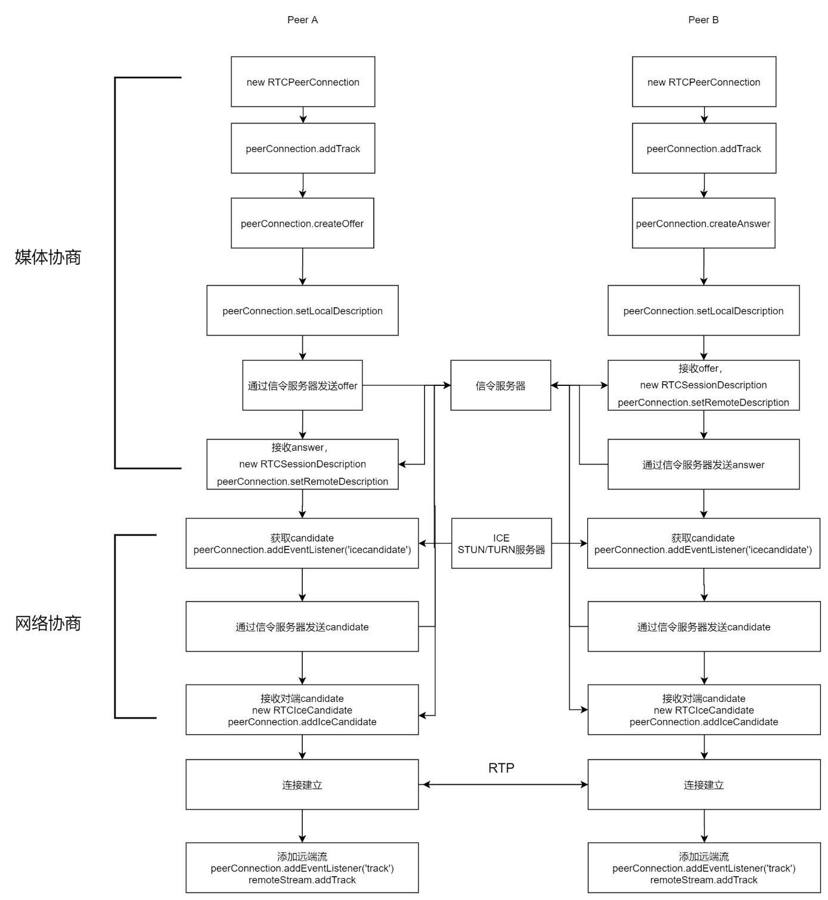

# webrtc连接建立过程

1. webrtc是一种规范也是一种协议，通过webrtc可以在2台设备之间传输媒体数据以及文本数据，android，ios，pc web等各个平台均已支持该协议

2. 使用webrtc建立连接并传输数据的过程大致包含三步，通过信令服务器交换sdp，交换candidate，建立连接

3. sdp是指的会话描述协议，是一种文本规范，用于描述会话中本端要发送的数据类型，数据格式，以及希望收到的数据类型，数据格式。与对端通过信令服务器交换sdp的过程称为媒体协商

4. candidate是指网络信息，可以通过ICE获取到。

5. ICE是统一各种NAT穿透技术的框架，穿透技术有STUN、TURN等。由于现在大多数设备没有公网ip，需要用到穿透技术，实现2台设备跨网络通讯

6. STUN是基于UDP的一种简单穿越的网络协议，在STUN服务器上会记录各个主机的公网ip以及对应的端口号.NAT网络有4种结构，其中有3种是可以使用STUN进行穿透，完全圆锥型，受限圆锥型，端口受限圆锥型。对称型NAT，也称为双向NAT，一般大型公司网路采用这种结构，只允许主机接受之前连接过的节点所建立的连线，必须使用TURN技术穿透

7. TURN是基于TCP，以数据中转的方式实现了网络穿透

8. 通过ICE获取到candidate信息后，通过信令服务器与对端交换candidate信息的过程称为网络协商

9.  完成媒体协商和网络协商后，2台设备间即可开始通讯，交换数据

10. web端调用api，建立连接的过程如下

